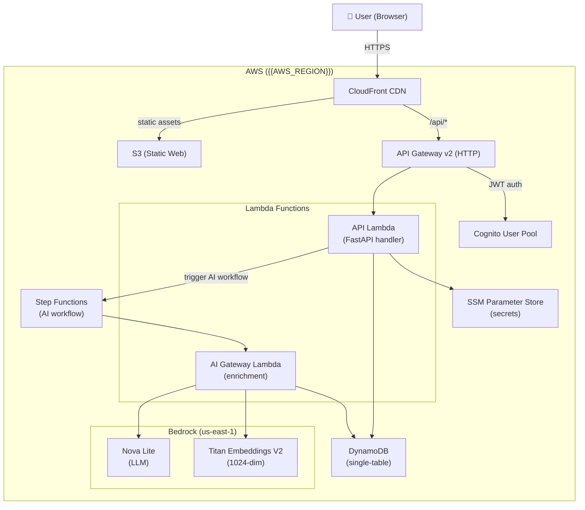
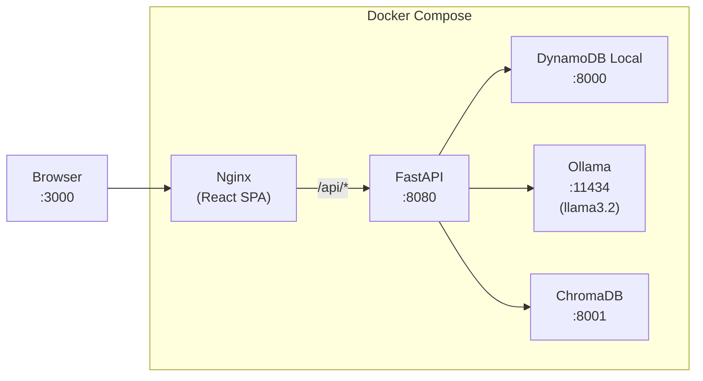
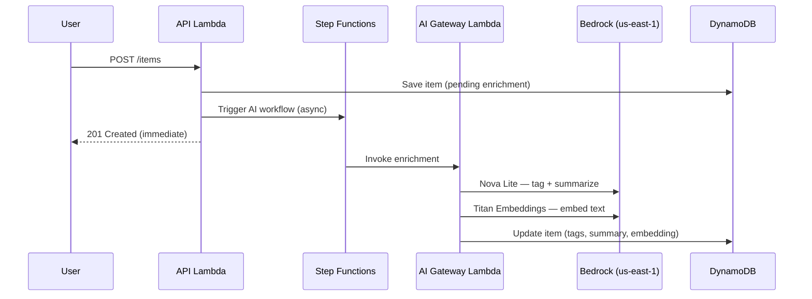

# Architecture — {{APP_TITLE}}

---

## Overview

{{APP_TITLE}} is a full-stack cloud application built on AWS, combining a containerized local dev experience with a serverless production architecture.



---

## Layers

| Layer | Local Dev | AWS Production |
|-------|-----------|----------------|
| **Frontend** | React (Vite dev server / Nginx :3000) | S3 + CloudFront |
| **API** | FastAPI container (:8080) | Lambda + API Gateway v2 |
| **Database** | DynamoDB Local (:8000) | DynamoDB |
| **Auth** | Static local user (`dev-user`) | Cognito User Pool (PKCE) |
| **LLM** | Ollama + llama3.2 (:11434) | Bedrock Nova Lite |
| **Embeddings** | Ollama + nomic-embed-text | Bedrock Titan Embeddings V2 |
| **Vector Store** | ChromaDB (:8001) | DynamoDB (vector SK) |
| **AI Workflow** | Direct API call | Step Functions |
| **Secrets** | Docker env vars | SSM Parameter Store |
| **IaC** | — | Terraform (modular) |

---

## Local Dev Stack



---

## DynamoDB Single-Table Design

All data lives in one table: `{{APP_PREFIX}}`

| Entity | PK | SK | Description |
|--------|----|----|-------------|
| Item | `USER#{userId}` | `ITEM#{createdAt}#{itemId}` | Core data record |
| Item lookup | `USER#{userId}` | `ITEMID#{itemId}` | Fast lookup by ID |
| Period Summary | `USER#{userId}` | `PERIOD_SUMMARY#{createdAt}#{id}` | AI-generated summary |
| Vector | `USER#{userId}` | `VECTOR#{itemId}` | RAG embedding (1024-dim) |
| Conversation | `USER#{userId}` | `CONVERSATION#{conversationId}` | RAG chat history |
| Audit log | `USER#{userId}` | `AUDIT#{timestamp}#{action}` | Admin audit trail |

---

## Terraform Modules

```
infra/terraform/
├── main.tf               ← orchestrates all modules
├── variables.tf
├── modules/
│   ├── auth/             ← Cognito User Pool + PKCE + pre-signup Lambda
│   ├── db/               ← DynamoDB single-table
│   ├── compute_lambda/   ← API Lambda + IAM role + ECR
│   ├── api_edge/         ← API Gateway v2 + JWT authorizer + CORS
│   ├── web_hosting/      ← S3 bucket + CloudFront OAC
│   ├── ai_gateway/       ← AI enrichment Lambda (opt-in)
│   └── workflow/         ← Step Functions state machine (opt-in)
└── environments/
    └── dev/dev.tfvars.example
```

---

## AI / RAG Flow



---

## Security

| Concern | Approach |
|---------|---------|
| Auth | Cognito PKCE flow — id_token validated by API Gateway JWT authorizer |
| User isolation | All queries scoped to `USER#{userId}` partition key |
| Secrets | API keys stored in SSM Parameter Store, never in code or env files |
| S3 | Block public access + CloudFront OAC (no public bucket policy) |
| CORS | Explicit allow list — no wildcards on non-`*` origins |
| IAM | Lambda execution roles scoped to minimum required DynamoDB/SSM operations |
